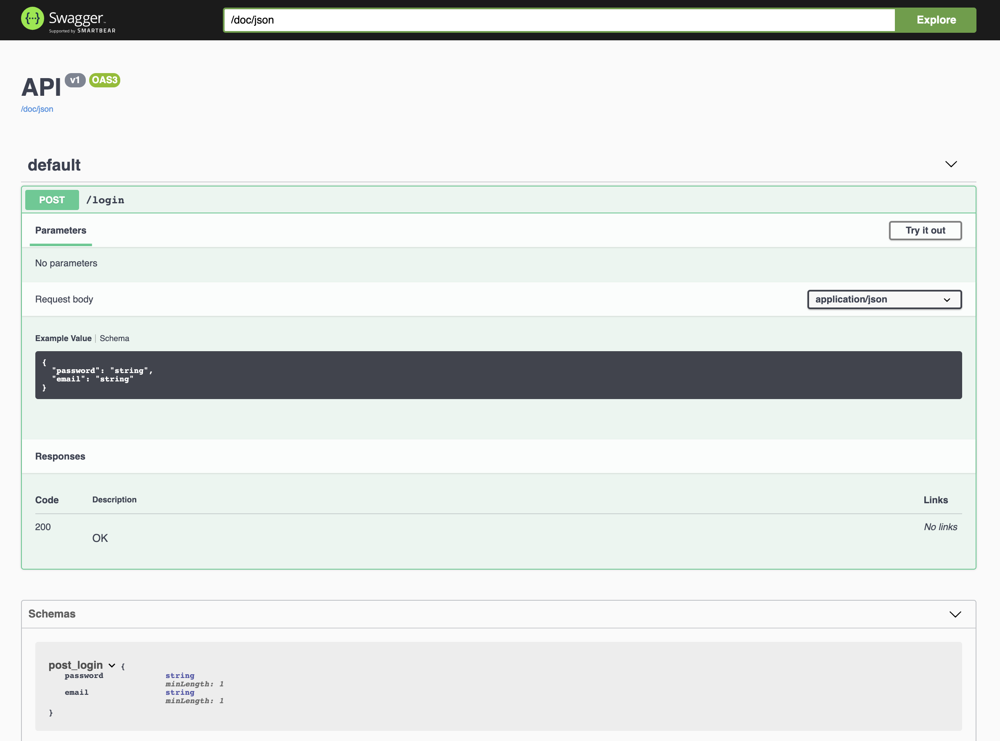

[](https://travis-ci.com/dgouyette/play-api-refined?branch=develop)
[](https://codecov.io/gh/dgouyette/play-api-refined)
[](https://opensource.org/licenses/MIT)


# Play API Refined

A tiny library to generate OpenAPI  documentation and json schema based on Refined's case classes.


## Context


## Setup

In order to use play-json-org.dgouyette.refined you need to add the following lines to your `build.sbt`:

```scala
resolvers += Resolver.bintrayRepo("dgouyette", "maven")

libraryDependencies += "org.dgouyette" %% "api-refiner" % "1.0.0-M1"
```

## Usage

### Play Json Refined  errors 

To return json errors based on org.dgouyette.refined classes you must import :

````scala
import org.org.dgouyette.json.RefinedRuntimeValidator._
````

### Json Schema on Client Error 

```scala
case class LoginDTO(email  : String Refined NonEmpty, password : String Refined NonEmpty)


@Singleton
class HomeController @Inject()(bp: BodyParserWithJsonSchema) extends AbstractController(cc) {
  implicit val loginSchema = JsonSchema.asJsValue[LoginDTO]
  implicit val dtoSchema = JsonSchema.asJsValue[SimpleDTO]
  
  def login(): Action[LoginDTO] = Action(bp.jsonRefined(LoginDTO.fmt, loginSchema)) {
    implicit request =>
    Ok
  }
}
``` 

With a bad client request : 

`curl -X POST http://localhost:9000/login -d '{"email" :"","password" :"" }'`

You will have this error 

```json
{
    "obj.email": [
        {
            "msg": [
                "Predicate isEmpty() did not fail."
            ],
            "args": []
        }
    ],
    "_schema": {
        "password": {
            "minLength": 1,
            "type": "string"
        },
        "email": {
            "minLength": 1,
            "type": "string"
        }
    },
    "obj.password": [
        {
            "msg": [
                "Predicate isEmpty() did not fail."
            ],
            "args": []
        }
    ]
}
```

## Generate OpenAPI (Swagger) Documentation

OpenAPIController : 
````scala
def json: Action[Unit] = Action(parse.empty) {
    implicit  req =>
     Ok(OpenAPI.fromRoutesFile("conf/routes"))
  }
````

conf/routes
```
POST        /login                           controllers.HomeController.login
GET         /doc/json                        controllers.OpenAPIController.json
```



